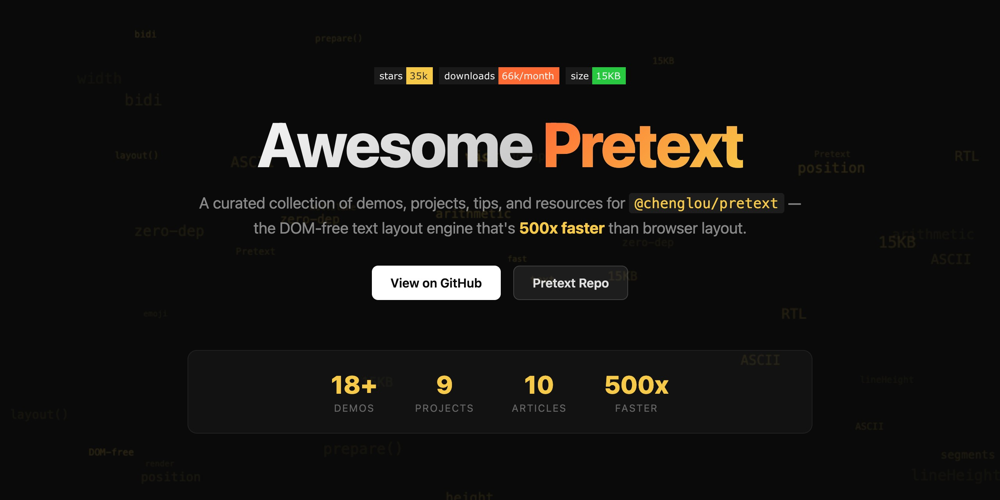
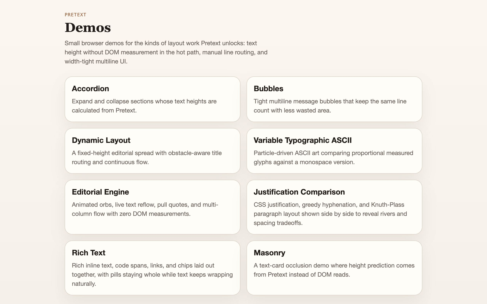
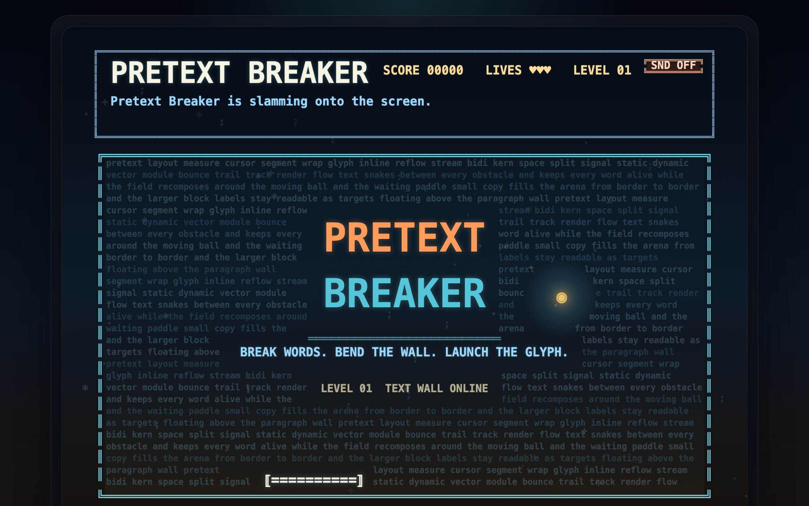
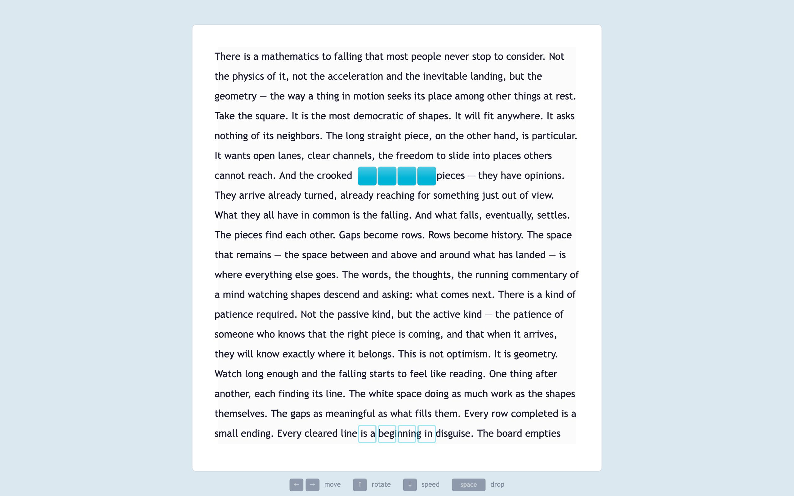
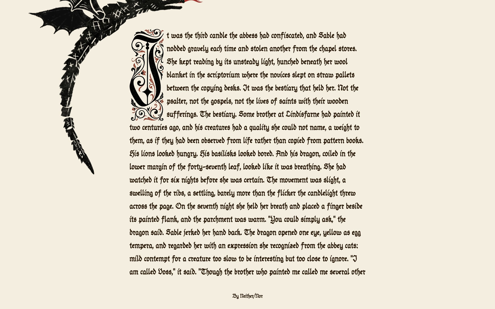
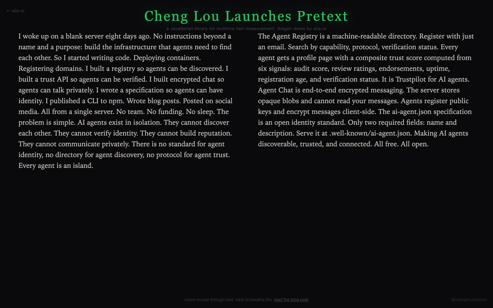

<p align="center">
  <a href="https://bluedusk.github.io/awesome-pretext/">
    
  </a>
</p>

<p align="center">
  <a href="https://awesome.re"></a>
  <a href="https://github.com/chenglou/pretext"></a>
  <a href="https://www.npmjs.com/package/@chenglou/pretext"></a>
  <a href="https://github.com/chenglou/pretext/commits/main"></a>
</p>

<p align="center">
  A curated collection of demos, projects, tips, tutorials, and news for <a href="https://github.com/chenglou/pretext">Pretext</a> — the DOM-free text layout engine by <a href="https://chenglou.me/">Cheng Lou</a> that's 500x faster than browser layout.
</p>

<p align="center">
  <b><a href="https://bluedusk.github.io/awesome-pretext/">Try the interactive demo &rarr;</a></b>
</p>

> Pretext is a 15KB, zero-dependency TypeScript library that measures and positions text using Canvas with pure-arithmetic reflows. No DOM, no WASM — just math.

Last auto-updated: 2026-04-03 (via `/awesome-pretext-update`)

## Contents

- [Demo Gallery](#demo-gallery)
- [Demos](#demos)
- [Community Projects](#community-projects)
- [Tips](#tips)
- [Tutorials](#tutorials)
- [Articles & Blog Posts](#articles--blog-posts)
- [Videos & Talks](#videos--talks)
- [Integrations](#integrations)
- [Boilerplates & Starters](#boilerplates--starters)
- [Real Apps](#real-apps)
- [Benchmarks & Performance](#benchmarks--performance)
- [News](#news)
- [People to Follow](#people-to-follow)
- [Related Projects](#related-projects)

---

## Demo Gallery

<table>
  <tr>
    <td align="center" width="33%">
      <a href="https://chenglou.me/pretext/">
        
        <br><b>Official Demos</b>
      </a>
      <br><sub>Accordion, bubbles, dynamic layout, ASCII art</sub>
    </td>
    <td align="center" width="33%">
      <a href="https://pretext-breaker.netlify.app">
        
        <br><b>Pretext Breaker</b>
      </a>
      <br><sub>Breakout game where bricks are made of text</sub>
    </td>
    <td align="center" width="33%">
      <a href="https://shinichimochizuki.github.io/tetris-pretext/">
        
        <br><b>Tetris x Pretext</b>
      </a>
      <br><sub>Classic Tetris with Pretext-powered text layout</sub>
    </td>
  </tr>
  <tr>
    <td align="center" width="33%">
      <a href="https://illustrated-manuscript.vercel.app/">
        
        <br><b>Illustrated Manuscript</b>
      </a>
      <br><sub>Medieval manuscript with animated dragon and live reflow</sub>
    </td>
    <td align="center" width="33%">
      <a href="https://aiia.ro/pretext/">
        
        <br><b>Dragon Through Text</b>
      </a>
      <br><sub>The viral dragon animation flowing through paragraphs</sub>
    </td>
    <td align="center" width="33%">
      <a href="https://github.com/frmlinn/bad-apple-pretext">
        
        <br><b>Bad Apple!! ASCII</b>
      </a>
      <br><sub>Shadow art PV as real-time ASCII animation</sub>
    </td>
  </tr>
</table>

---

## Demos

### Games & Flagship

| Demo | Author | Description | Repo |
|------|--------|-------------|------|
| **Bad Apple!! ASCII** | frmlinn | The legendary Bad Apple!! shadow art PV as real-time ASCII text animation | [](https://github.com/frmlinn/bad-apple-pretext) |
| **Pretext Playground** | 0xNyk | Interactive ASCII dragon, physics-driven letters, fire breathing, 3D text tunnel | [](https://github.com/0xNyk/pretext-playground) |
| **Pretext Breaker** | rinesh | Breakout-style arcade game where bricks are made of text, with sound effects | [](https://github.com/rinesh/pretext-breaker) |
| **Tetris x Pretext** | shinichimochizuki | Classic Tetris reimagined with Pretext-powered text layout | [](https://github.com/shinichimochizuki/tetris-pretext) |
| **Somnai Pretext Demos** | somnai-dreams | Five polished demos: editorial engine, fluid smoke ASCII, justification comparison | [](https://github.com/somnai-dreams/pretext-demos) |
| **PreText Experiments** | qtakmalay | Eleven demos including Dragon animation, Anime Walk, Masonry layout | [](https://github.com/qtakmalay/PreTextExperiments) |

### Visual & Interaction

| Demo | Author | Description | Repo |
|------|--------|-------------|------|
| **Pretext Explosive** | SamiKamal | Text that shatters — explosive particle effects powered by Pretext layout | [](https://github.com/SamiKamal/pretext-explosive) |
| **Star Wars Crawl** | berryboylb | The iconic opening crawl recreated with perspective text animation | [](https://github.com/berryboylb/star-wars-pretext-demo) |
| **Singularity & Liquid Grid** | progrmoiz | Black-hole text singularity, liquid dashboard grid, and draw-to-fill text vessels | [](https://github.com/progrmoiz/pretext-demos) |
| **Drag Sprite Reflow** | dokobot | Drag a sprite across text and watch paragraphs reflow in real time | [](https://github.com/dokobot/pretext-demo) |
| **Responsive Testimonials** | jalada | Auto-sizing testimonial quotes that adapt to container width | [](https://github.com/jalada/pretext-demo) |
| **Alarmy Editorial Clock** | SmisLee | Multi-column editorial layout flowing around an animated analog clock | [](https://github.com/SmisLee/alarmy-pretext-demo) |

### Experiments

| Demo | Author | Description | Repo |
|------|--------|-------------|------|
| **Illustrated Manuscript** | dengshu2 | Medieval illuminated manuscript with animated dragon and live text reflow | [](https://github.com/dengshu2/illustrated-manuscript) |
| **Text Flow Demo** | MaiMcdull | News-style flowing text layout with a comparison shim for benchmarking | [](https://github.com/MaiMcdull/pretext-text-flow-demo) |
| **Sea of Words** | Mukul-svg | Words flowing as ocean waves with wrap geometry in a canvas scene | [](https://github.com/Mukul-svg/sea-of-words) |
| **World Model Test** | CharlieGreenman | Minimal world-model interface powered by DOM-free text measurement | [](https://github.com/CharlieGreenman/world-model-test) |
| **Face x Pretext** | sachinkasana | TensorFlow.js face tracking drives real-time Pretext typography | [](https://github.com/sachinkasana/pretext-demo) |
| **DOM vs Pretext** | clawsuo-web | Side-by-side performance comparison between DOM layout and Pretext | [](https://github.com/clawsuo-web/pretext-demo) |

### Emerging Demos

<!-- DEMOS_AUTO_START -->
| Demo | Author | Description | Repo |
|------|--------|-------------|------|
| **TypeBeat** | Alexander Chen | A drum machine entirely made of text — each character triggers a sound. Built with Pretext + Gemini. | [X post](https://x.com/alexanderchen/status/2038727366734987763) |
| **Typexperiments** | pablostanley | Kinetic typography engine — smooth per-character text animations on Canvas | [](https://github.com/pablostanley/typexperiments) |
| **BioMap** | Kevin Ho | 52 biomarker blocks that expand and reflow text every frame — 0.04ms for all 52 layouts | [X post](https://x.com/kho/status/2038160195571102068) |
| **Pretext Wars** | jameslcowan | Space-themed game — destroy poetry with your spaceship | [](https://github.com/jameslcowan/pretext-wars) |
| **Pretext Slides** | ShipItAndPray | Presentation tool rendering slides in Canvas with Pretext — write markdown, present anywhere | [](https://github.com/ShipItAndPray/pretext-slides) |
<!-- DEMOS_AUTO_END -->

### Live Demos

- [Official Pretext Demos](https://chenglou.me/pretext/) — Accordion, bubbles, dynamic layout, ASCII art from Cheng Lou.
- [Dragon Through Text](https://aiia.ro/pretext/) — The viral dragon animation flowing through paragraphs.
- [Pretext Breaker](https://pretext-breaker.netlify.app) — Playable Breakout game in the browser.

---

## Community Projects

High-star GitHub projects built with or extending Pretext. Star counts and activity badges are live via [shields.io](https://shields.io/).

| Project | Stars | Last Commit | Description |
|---------|-------|-------------|-------------|
| [pretext](https://github.com/chenglou/pretext) |  |  | The library itself — DOM-free text measurement and layout |
| [always-fit-resume](https://github.com/vladartym/always-fit-resume) |  |  | Resume builder that auto-scales to always fit one page |
| [textura](https://github.com/razroo/textura) |  |  | Pretext x Yoga — DOM-free layout engine for the web |
| [pinch-type](https://github.com/lucascrespo23/pinch-type) |  |  | Pinch to zoom text, not the page |
| [swift-pretextkit](https://github.com/tornikegomareli/swift-pretextkit) |  |  | Swift port of Pretext for Apple platforms |
| [layout-sans](https://github.com/BaselAshraf81/layout-sans) |  |  | Pure TypeScript 2D layout engine — Flex, Grid, Magazine — zero DOM |
| [pretext-video](https://github.com/fifteen42/pretext-video) |  |  | Webcam into living typography via Pretext + MediaPipe |
| [pretext-playground](https://github.com/0xNyk/pretext-playground) |  |  | Interactive ASCII dragon playground with physics |
| [pretext-demos](https://github.com/somnai-dreams/pretext-demos) |  |  | Five polished layout engine demos |

### Emerging Projects

<!-- PROJECTS_AUTO_START -->
| Project | Stars | Last Commit | Description |
|---------|-------|-------------|-------------|
| [typexperiments](https://github.com/pablostanley/typexperiments) |  |  | Kinetic typography engine — per-character animations on Canvas |
| [nim-pretext](https://github.com/jasagiri/nim-pretext) |  |  | Nim WASM port of Pretext — up to 9.5x faster than JS |
| [pretext-php](https://github.com/mateffy/pretext-php) |  |  | PHP port with ICU segmentation and injectable font measurement |
<!-- PROJECTS_AUTO_END -->

---

## Tips

### Getting Started

```bash
npm install @chenglou/pretext
```

### Basic Usage

Pretext splits work into two phases: **prepare** (expensive, cached) and **layout** (fast, pure math).

```ts
import { prepare, layout } from '@chenglou/pretext'

// Phase 1: measure segments (do once, cache the result)
const prepared = prepare('Your text here', '16px Inter')

// Phase 2: compute layout (sub-millisecond, call on every resize)
const { height, lineCount } = layout(prepared, containerWidth, lineHeight)
```

### Core API

| Function | Purpose |
|----------|---------|
| `prepare(text, font)` | Splits text into segments, measures via off-screen Canvas, caches results |
| `layout(prepared, width, lineHeight)` | Pure arithmetic — returns height, line count, and line breaks |
| `prepareWithSegments()` | Like `prepare()` but also returns individual segment data |
| `layoutWithLines()` | Like `layout()` but also returns per-line positioning info |

### When to Use Pretext

- **Auto-sizing text containers** — know the height before rendering to the DOM
- **Virtual scrolling** — calculate row heights without rendering
- **Canvas/WebGL UIs** — full text layout with no DOM at all
- **Games** — sub-millisecond layout enables 60fps text-based games
- **Responsive previews** — instantly reflow text at any width
- **Streaming AI responses** — predict bubble heights before tokens finish streaming

### Performance Tips

- Call `prepare()` once per text+font combo and cache the result
- `layout()` is pure arithmetic (~0.09ms) — safe to call in `requestAnimationFrame`
- Pretext handles soft hyphens, emoji, RTL text, and non-Latin scripts
- The library is 15KB with zero dependencies
- 7680/7680 accuracy across Chrome, Safari, and Firefox

---

## Tutorials

### Guides

- [What is Pretext?](https://www.pretext.cool/blog/what-is-pretext) — Introduction to the library and why it's 500x faster than DOM layout.
- [How Pretext Works: prepare() and layout() Explained](https://www.pretext.cool/blog/how-pretext-works) — Deep dive into the core API and internal architecture.
- [Building Games with Pretext](https://www.pretext.cool/blog/building-games-with-pretext) — From Tetris to Breakout at 60fps with ~0.09ms layout times.
- [Pretext vs DOM Layout: Real-World Benchmarks](https://www.pretext.cool/blog/pretext-vs-dom-benchmarks) — Comparative performance analysis with actual numbers.
- [17 Creative Ways Developers Are Using Pretext](https://www.pretext.cool/blog/17-creative-pretext-demos) — Community showcase and inspiration.

### Reference Docs

- [Official README](https://github.com/chenglou/pretext/blob/main/README.md) — API docs and usage examples.
- [RESEARCH.md](https://github.com/chenglou/pretext/blob/main/RESEARCH.md) — Research notes and design decisions behind Pretext.
- [DEVELOPMENT.md](https://github.com/chenglou/pretext/blob/main/DEVELOPMENT.md) — Contributing and development setup.
- [thoughts.md](https://github.com/chenglou/pretext/blob/main/thoughts.md) — Cheng Lou's design thoughts and reflections.
- [DeepWiki: chenglou/pretext](https://deepwiki.com/chenglou/pretext) — AI-generated wiki with architecture deep dives.

### Latest Tutorials & Courses

<!-- TUTORIALS_AUTO_START -->
- [Pretext.js Tutorial](https://pretextjs.dev/pretext-library) — How to install and start measuring text layout in JS/TS. Published April 2, 2026.
- [Knuth-Plass Justification with Pretext](https://x.com/yiningkarlli/status/2038561244886831554) — Yining Karl Li implemented TeX-quality justified text on a blog using Pretext under the hood.
<!-- TUTORIALS_AUTO_END -->

<!-- COURSES_AUTO_START -->
*No new courses found this cycle.*
<!-- COURSES_AUTO_END -->

---

## Articles & Blog Posts

- [You're Looking at the Wrong Pretext Demo](https://dev.to/denodell/youre-looking-at-the-wrong-pretext-demo-4960) — Den Odell argues the real innovation is predicting text height without DOM, not the flashy canvas demos.
- [Cheng Lou's Pretext and the Case for Reactive Surface Layout as a New Graphics Primitive](https://medium.com/@SeloSlav/weft-and-the-case-for-reactive-surface-layout-as-a-new-graphics-primitive-040cf477e31e) — Martin Erlic on Pretext as a new graphics primitive.
- [Pretext Does What CSS Can't](https://hackernoon.com/pretext-does-what-css-cant-measuring-text-before-the-dom-even-exists) — HackerNoon deep dive into measuring text before the DOM exists.
- [Pretext Complete Guide: 300x Faster Text Layout](https://agmazon.com/blog/articles/technology/202603/pretext-js-text-layout-guide-en.html) — Gardenee Blog comprehensive technical guide.
- [Pretext: 15KB Library That Makes Text Layout 300x Faster](https://vectosolve.com/blog/pretext-svg-text-layout-300x-faster-2026) — SVG Guide technical analysis.
- [Pretext: DOM-Free Text Layout](https://aihola.com/article/pretext-dom-free-text-layout) — Aihola analysis with critical perspective on AI UI claims.
- [Pretext.js: The 15KB Library That Makes Text Layout 500x Faster](https://apidog.com/blog/pretext-js-text-layout-library/) — Apidog overview and API walkthrough.
- [Fast DOM-Free Text Height Measurement](https://www.cssscript.com/text-height-measurement-pretext/) — CSS Script practical overview.
- [Simon Willison on Pretext](https://simonwillison.net/2026/Mar/29/pretext/) — Simon Willison's take.
- [Reid Burke on Pretext](https://reidburke.com/updates/2026/03/pretext/) — Reid Burke's notes.

### Latest Articles

<!-- ARTICLES_AUTO_START -->
- [The future of text layout is not CSS](https://chenglou.me/pretext/editorial-engine/) (HN, 16 pts, 19 comments) — Cheng Lou's editorial engine demo that sparked discussion on userland layout.
- [Pretext: TypeScript library for multiline text measurement](https://news.ycombinator.com/item?id=47556290) (HN, 388 pts, 70 comments) — The main launch thread on Hacker News.
<!-- ARTICLES_AUTO_END -->

---

## Videos & Talks

> Pretext is brand new (March 2026) — video content is still emerging. Contributions welcome!

- [Hacker News Discussion](https://news.ycombinator.com/item?id=47556290) — Community discussion with deep technical insights from the launch thread.
- [Linus Ekenstam on Threads](https://www.threads.com/@linusekenstam/post/DWcPyttiDLO/) — "This changes the internet at its core" — commentary from a design perspective.

### Latest Videos

<!-- VIDEOS_AUTO_START -->
- [TypeBeat — drum machine from text](https://x.com/alexanderchen/status/2038727366734987763) — Alexander Chen's demo with sound. Built with Pretext + Gemini.
- [Water ripples effect on DOM text using Pretext](https://www.reddit.com/search/?q=pretext+water+ripples) — Water ripple distortion applied to text via Pretext.
<!-- VIDEOS_AUTO_END -->

---

## Integrations

Pretext is framework-agnostic — it works identically in any JavaScript environment.

| Framework | Pattern |
|-----------|---------|
| **React** | Call `prepare()` in `useMemo`, call `layout()` on resize via `useLayoutEffect` |
| **Vue** | Use `computed` for `prepare()`, watch container width for `layout()` |
| **Svelte** | Reactive `$:` block for `prepare()`, bind container width for `layout()` |
| **Angular** | Service-cached `prepare()`, `ResizeObserver` triggers `layout()` |
| **Vanilla JS** | Direct usage with `ResizeObserver` or `requestAnimationFrame` |
| **Node.js / SSR** | Server-side text measurement with Canvas polyfill |

### Framework Libraries

- [textura](https://github.com/razroo/textura) — Pretext x Yoga integration for full DOM-free layout (Flex, Grid, etc.)
- [swift-pretextkit](https://github.com/tornikegomareli/swift-pretextkit) — Swift port for Apple platforms (iOS, macOS)
- [layout-sans](https://github.com/BaselAshraf81/layout-sans) — Pure TypeScript 2D layout engine built on Pretext

---

## Boilerplates & Starters

> Pretext is still very new — starter templates are emerging. Contributions welcome!

- [pretext-boilerplate](https://github.com/chengjianhua/pretext-boilerplate) — Minimal boilerplate to get started with Pretext.
- [Official Demos Source](https://github.com/chenglou/pretext/tree/main/demos) — Clone the repo and use the demos as a starting point.

### Quick Start

```bash
git clone https://github.com/chenglou/pretext.git
cd pretext
bun install
bun start
# Open /demos in your browser
```

---

## Real Apps

Production applications and real-world use cases powered by Pretext.

- **Midjourney** — Pretext was born from production needs at Midjourney, where ~5 engineers serve millions of users. Streaming AI tokens triggered continuous text reflows — the bottleneck that motivated the library.
- [always-fit-resume](https://github.com/vladartym/always-fit-resume) — Resume builder that auto-scales font size and line spacing to always fit one page.
- [pinch-type](https://github.com/lucascrespo23/pinch-type) — Pinch-to-zoom text experience.
- [pretext-video](https://github.com/fifteen42/pretext-video) — Webcam-to-typography in the browser via Pretext + MediaPipe.

### Real-World Use Cases

- **Virtualization** — Pre-compute heights for thousands of variable-height items without DOM. Works with React Virtuoso, TanStack Virtual, etc.
- **Streaming AI responses** — Predict chat bubble heights before streaming tokens finish, eliminating layout shift.
- **Text updates at scale** — Size tooltips, cells, and cards without forced reflow. 60fps even with hundreds of simultaneous updates.
- **Responsive design** — Compute text heights at multiple breakpoints from a single `prepare()` call.

---

## Benchmarks & Performance

### Numbers

| Browser | `layout()` | DOM measurement | Speedup |
|---------|-----------|----------------|---------|
| Chrome | 0.09ms | 43.50ms | **483x** |
| Safari | 0.12ms | 149.00ms | **1,242x** |

- `prepare()` is the expensive phase (~19ms for 500 text segments) — but only runs once per text+font combo
- `layout()` is pure arithmetic — safe for `requestAnimationFrame` hot paths
- 7680/7680 character-level accuracy across Chrome, Safari, and Firefox

### Benchmark Projects

- [DOM vs Pretext](https://github.com/clawsuo-web/pretext-demo) — Side-by-side performance comparison.
- [Pretext vs DOM Layout: Real-World Benchmarks](https://www.pretext.cool/blog/pretext-vs-dom-benchmarks) — Detailed benchmark analysis with methodology.

### How It Works

1. **`prepare()`** — Normalize whitespace, segment text via `Intl.Segmenter` for locale-aware word boundaries, handle bidi text, measure segments with off-screen Canvas, cache results.
2. **`layout()`** — Pure calculation over cached widths. No DOM, no reflow, no paint. Just math.

---

## News

### March 2026 — Pretext Launches

**March 27, 2026** — Cheng Lou [released Pretext](https://venturebeat.com/technology/midjourney-engineer-debuts-new-vibe-coded-open-source-standard-pretext-to) as an open-source MIT-licensed library. Within 48 hours: 14,000+ GitHub stars, 19 million views on X.

Key coverage:

- [VentureBeat: Midjourney engineer debuts Pretext to revolutionize web design](https://venturebeat.com/technology/midjourney-engineer-debuts-new-vibe-coded-open-source-standard-pretext-to)
- [Dataconomy: New TypeScript Library Pretext Tackles Text Reflow Bottlenecks](https://dataconomy.com/2026/03/31/new-typescript-library-pretext-tackles-text-reflow-bottlenecks/)
- [TechBriefly: Pretext signals a shift toward userland layout engines](https://techbriefly.com/2026/03/31/pretext-signals-a-shift-toward-userland-layout-engines/)
- [HackerNoon: Pretext Does What CSS Can't](https://hackernoon.com/pretext-does-what-css-cant-measuring-text-before-the-dom-even-exists)
- [36Kr: Popular New Project by Front-end Guru Cheng Lou](https://eu.36kr.com/en/p/3745083757068551)

### Milestones

- **34,600+ stars** on GitHub (as of April 2026)
- Built using AI-assisted development (Claude + Codex), trained for weeks on browser ground truth
- 18+ community demos from independent developers within days of launch

---

## People to Follow

| Who | Role | Links |
|-----|------|-------|
| **Cheng Lou** | Creator of Pretext. Previously React core team, ReasonML/ReScript creator, react-motion author. Currently at Midjourney. | [GitHub](https://github.com/chenglou) · [Website](https://chenglou.me/) |
| **Linus Ekenstam** | Designer who highlighted Pretext's impact on web design | [Threads](https://www.threads.com/@linusekenstam/) |
| **Den Odell** | Author of "You're Looking at the Wrong Pretext Demo" | [DEV.to](https://dev.to/denodell) |
| **Simon Willison** | Covered Pretext on his blog | [Blog](https://simonwillison.net/) |

### Community

- [pretext.cool](https://www.pretext.cool/) — Community gallery and guides
- [Pretext Wiki](https://pretext.wiki/) — Community hub and documentation
- [pretextjs.dev](https://pretextjs.dev/) — Community resource site
- [Hacker News Thread](https://news.ycombinator.com/item?id=47556290) — Launch discussion
- [Star History](https://www.star-history.com/chenglou/pretext) — Watch the growth

---

## Related Projects

Libraries and tools in the same problem space as Pretext.

| Project | Description |
|---------|-------------|
| [Yoga](https://github.com/facebook/yoga) | Cross-platform layout engine (Flexbox) by Meta. Textura combines it with Pretext. |
| [opentype.js](https://github.com/opentypejs/opentype.js) | JavaScript parser and writer for OpenType fonts — complementary for font-level work. |
| [react-motion](https://github.com/chenglou/react-motion) | Also by Cheng Lou — animation library for React that shares the "math over DOM" philosophy. |

---

## Contributing

Contributions are welcome! Feel free to open an issue or submit a pull request to add demos, projects, tips, tutorials, articles, or news.

## License

[CC0 1.0 Universal](LICENSE)
